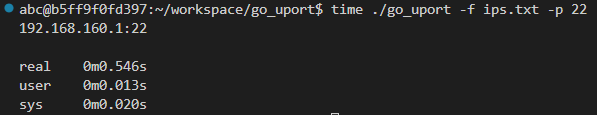

# go_uport
Scan large numbers of networks looking for an opened port (tcp) - very fast

## Usage

`./go_uport -f ips.txt -p 80`

## Bench

Scanning a /24 network for port 22 :

Execution time will always be higher than timeout (500ms) because the tool also try to scan .0 and .255 addresses.
